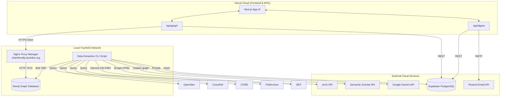

# PhilAI Connect

A dynamic web platform mapping the intersection of Artificial Intelligence and Classical Philosophy through a live, physics-based argument map.

## 🏗️ Architecture & Tech Stack

PhilAI Connect uses a hybrid cloud/local architecture, blending a Vercel-hosted Next.js frontend with a self-hosted TrueNAS Neo4j Graph Database.

### Core Technologies

- **Frontend / Framework**: Next.js 14 (App Router), React, TypeScript, Tailwind CSS
- **Graph Visualization**: `react-force-graph-2d` (HTML5 Canvas physics engine)
- **Relational Database & Auth**: Supabase (PostgreSQL) - Stores users, articles, and email subscribers
- **Graph Database**: Neo4j (Self-hosted via Docker on TrueNAS) - Stores paper lineage and categorical edges
- **AI Processing**: Google Gemini API (`gemini-1.5-flash`) - Generates philosophical categorizations and 3-sentence TL;DRs
- **Data Sources**: arXiv, OpenAlex, CrossRef, CORE, PhilArchive (OAI-PMH), Stanford Encyclopedia of Philosophy (SEP), Semantic Scholar (citation graph)
- **Email Digest**: Resend API & React Email
- **Networking/Proxy**: DuckDNS & Nginx Proxy Manager (Bridges Vercel Serverless to Local NAS)

### Architecture Diagram



## 🚀 Getting Started Locally

First, install dependencies:

```bash
npm install
```

Ensure your `.env.local` is populated with your API keys and Database URIs.

Then, run the development server:

```bash
npm run dev
```

Open [http://localhost:3000](http://localhost:3000) with your browser to see the result.

## 🧠 Populating Data

The graph is populated by a data extraction pipeline that scrapes semantic datasets, analyzes abstracts with Gemini, and injects them into Neo4j and Supabase simultaneously.

To run the extractor:

```bash
npx tsx --env-file=.env.local scripts/extractArxiv.ts
```

## 📈 Deployment

This project is configured for seamless deployment on **Vercel**.
Because Vercel's serverless edge functions cannot easily connect to raw TCP socket databases (like Neo4j's Bolt protocol), the `src/lib/db/neo4j.ts` driver is custom-built to automatically polyfill the connection. If it detects an `https://` proxy URL, it falls back to native HTTP Fetch requests to cleanly pass through cloud routing!
